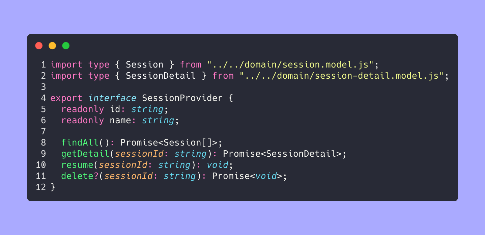
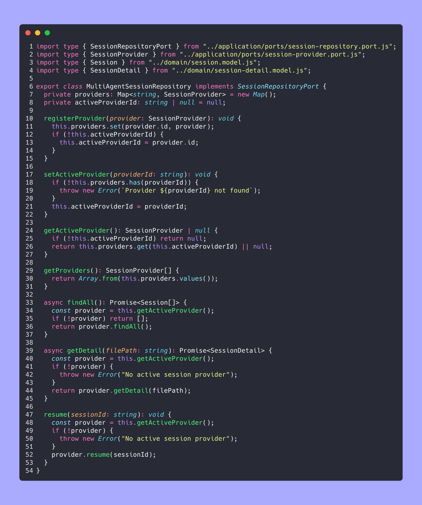
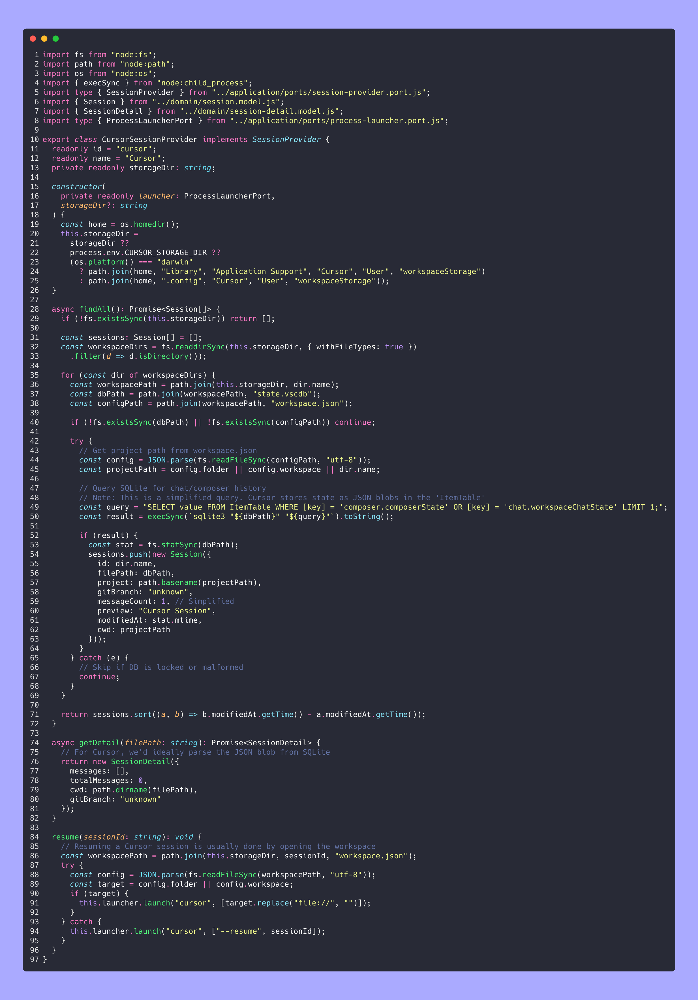

# Architecture

**agent-sessions** follows a **vertical-slice hexagonal architecture** with a **provider-based system** for multi-agent support.

## Layer Diagram

```
┌──────────────────────────────────────────────────────────┐
│  Presenters (Ink/React)                                  │
│  ├── App, AgentSelector, SessionTable, SessionPreview    │
│  ├── Hooks (useSessions)                                 │
│  └── Formatters                                          │
├──────────────────────────────────────────────────────────┤
│  Application (Use Cases)                                 │
│  ├── ListSessionsUseCase                                 │
│  ├── GetSessionDetailUseCase                             │
│  ├── DeleteSessionUseCase                                │
│  └── ResumeSessionUseCase                                │
├──────────────────────────────────────────────────────────┤
│  Infrastructure (Providers & Adapters)                   │
│  ├── MultiAgentSessionRepository (Registry)              │
│  ├── ClaudeSessionProvider                               │
│  ├── GeminiSessionProvider                               │
│  ├── OpenAICodexProvider                                 │
│  ├── CursorSessionProvider                               │
│  ├── FsSessionStorageAdapter                             │
│  └── JSONL / SQLite parser                               │
├──────────────────────────────────────────────────────────┤
│  Domain (Pure Business Logic)                            │
│  ├── Session entity                                      │
│  ├── SessionDetail + SessionMessage                      │
│  └── matchesFilter logic                                 │
└──────────────────────────────────────────────────────────┘
```

## Multi-Agent Provider System

The core of the multi-agent support is the `SessionProvider` interface:



The `MultiAgentSessionRepository` acts as a registry for these providers.



When an agent is selected in the UI, the repository sets the corresponding provider as "active," and all subsequent use case calls are delegated to that provider.

### Example: Cursor Session Provider

Cursor stores sessions as SQLite databases at `~/.cursor/chats/<hash>/<uuid>/store.db`. The provider reads the `meta` table for session metadata (name, agent ID, model) and the `blobs` table for conversation messages. On Windows, the path falls back to `%APPDATA%/Cursor/chats/`.



## Directory Structure

```
src/
├── domain/session/                  # Session domain module
│   ├── domain/                      # Pure business logic
│   │   ├── session.model.ts         # Session entity + filtering
│   │   ├── session-detail.model.ts  # Conversation detail model
│   │   └── session.error.ts         # Domain errors
│   ├── application/                 # Use cases + ports
│   │   ├── ports/                   # Interface contracts
│   │   │   ├── session-provider.port.ts
│   │   │   ├── session-repository.port.ts
│   │   │   ├── session-storage.port.ts
│   │   │   ├── process-launcher.port.ts
│   │   │   └── provider-management.port.ts
│   │   └── use-cases/
│   │       ├── list-sessions.use-case.ts
│   │       ├── get-session-detail.use-case.ts
│   │       ├── delete-session.use-case.ts
│   │       └── resume-session.use-case.ts
│   ├── infrastructure/
│   │   ├── adapters/                # Generic adapters
│   │   │   ├── multi-agent-session-repository.adapter.ts
│   │   │   ├── fs-session-storage.adapter.ts
│   │   │   └── cli-process-launcher.adapter.ts
│   │   ├── providers/               # One folder per agent
│   │   │   ├── claude/
│   │   │   ├── cursor/
│   │   │   ├── gemini/
│   │   │   └── openai/
│   │   └── parsers/
│   │       └── jsonl-parser.ts
│   ├── presenters/                  # UI layer (Ink/React)
│   │   ├── components/              # AgentSelector, Table, etc.
│   │   ├── hooks/                   # useSessions
│   │   └── formatters/              # Table formatting
│   └── session.module.ts            # Module wiring (DI)
├── common/helpers/                  # Cross-domain utilities
└── cli.tsx                          # Entry point
```

## Module Wiring

`session.module.ts` initializes the repository and registers all providers:

```ts
export function createSessionModule() {
  const providers = [
    new ClaudeSessionProvider(),
    new CursorSessionProvider(),
    new GeminiSessionProvider(),
    new OpenAICodexProvider(),
  ];

  const repository = new MultiAgentSessionRepositoryAdapter(providers);
  const launcher = new CliProcessLauncherAdapter();
  const storage = new FsSessionStorageAdapter();

  return {
    listSessionsUseCase: new ListSessionsUseCase(repository),
    getSessionDetailUseCase: new GetSessionDetailUseCase(repository),
    resumeSessionUseCase: new ResumeSessionUseCase(launcher, providers),
    deleteSessionUseCase: new DeleteSessionUseCase(storage),
    multiAgentRepository: repository,
  };
}
```

Tests are co-located with source files (`*.spec.ts`).
