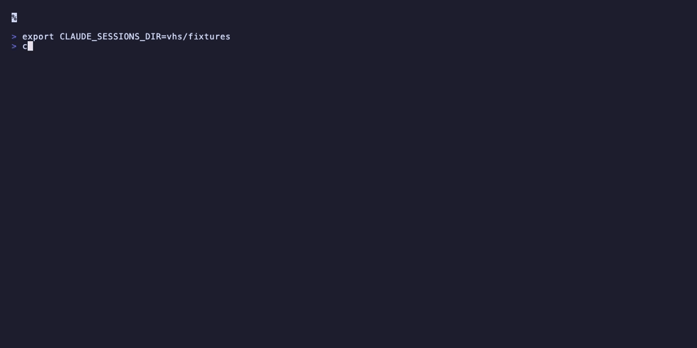

# Introduction

**claude-sessions** is an interactive terminal UI (TUI) tool for browsing, searching, and resuming [Claude Code](https://docs.anthropic.com/en/docs/claude-code) sessions.

Claude Code provides `--resume <session-id>` and `--continue`, but no way to browse or search through your session history. This tool fills that gap.

## Why?

- You have dozens (or hundreds) of Claude Code sessions
- You want to find that conversation from last week about the auth refactor
- You want to clean up old sessions cluttering your `~/.claude/projects/` directory
- You don't want to manually copy-paste session IDs

## Features

| Feature | Description |
|---------|-------------|
| **Browse** | All sessions sorted by most recent |
| **Metadata** | Date, project, git branch, message count, first message preview |
| **Preview** | Peek into a session's conversation before resuming |
| **Search** | Live filter across project, branch, and message text |
| **Resume** | Launch `claude --resume` with one keypress |
| **Delete** | Remove old sessions with confirmation |
| **fzf mode** | Alternative selection via fzf for power users |

## Tech Stack

- **TypeScript** with strict mode
- **Ink** (React for the terminal) for the TUI
- **Commander** for CLI argument parsing
- **Vitest** for testing
- **Hexagonal architecture** with clean domain separation

## Requirements

- Node.js 20+
- [Claude Code](https://docs.anthropic.com/en/docs/claude-code) CLI installed
- [fzf](https://github.com/junegunn/fzf) (optional, for `--fzf` mode)
